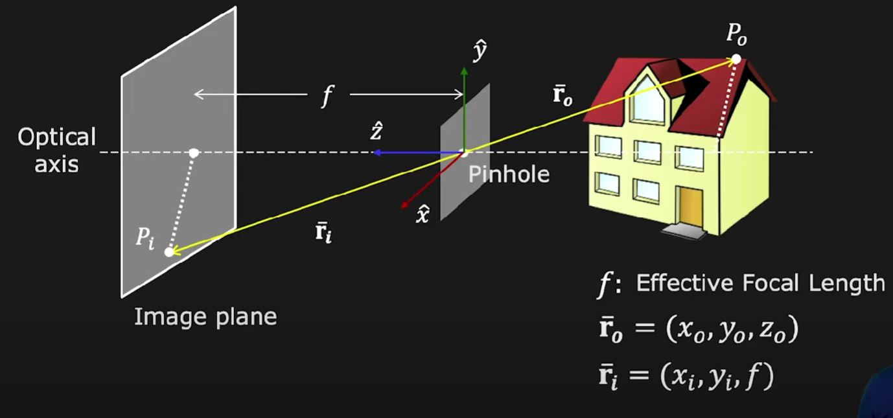

# Computer Vision

This is intended to be used as a wiki for anything computer vision related. It is aimed to introduce the concepts of computer vision at an introductory level.

## Contents

- [ELI5 Computer Vision](#eli5-computer-vision)
- [Vision in VEX 23-24](#why-use-vision-in-the-vex-2023-2024-season)
- [Modules](#modules)
- [Prerequisites](#prerequisites)
- [Imaging](#imaging)
    - [Image Formation](#image-formation)
- [Resources](#resources)
    - [Libraries](#libraries)
    - [Videos/Playlists](#videosplaylists)

## ELI5 Computer Vision

Computer vision is a field that enables systems to derive information from images, videos and other visual inputs. It involves extraction, analysis, and the understanding of useful information from a single image or a sequence of images, aiming to replicate the way the human vision system works. Practical applications include image recognition, object detection, facial recognition, and video analysis. AI and machine learning is often employed to process this visual data.

## Why use vision in the VEX 2023-2024 season?

To be honest, I can't see how useful vision would be considering that the primary goal is to get as many tri-balls into the goal. This can easily be accomplished using wings or extended side arms to push the tri-balls into the goal. However, during Nationals, if I am recalling correctly, Griffith Univserity supposedly utilized computer vision for their omni-wheeled robot. The premise was that by using a Vex vision sensor or equivalent camera, they were able to "lock" onto a tri-ball and take advantage of the manueverability of the robot's omni-wheels, i.e. the robot could move whichever way and the robot would automatically always point into the direction of the tri-ball. This is analogous to a top-down shooter game where if you locked onto a target, you could run around the target while still pointing at them.

I would imagine that vision could also be used for object detection to avoid collision with objects but the efficiency of using such a method as opposed to using proximity sensors is yet to be determined. Vision could also possible be used in conjunction with SLAM (Simultaneous Localization and Mapping). An offshoot in this area is using lidar with LOAM (Lidar Odometry and Mapping).

## Modules

- Imaging: Image formation, sensing, processing
- Features: Edges boundaries, Scale-Invariant Feature Transform (SIFT), applications
- Reconstruction Pt. 1: Shading, focus, active illumination
- Reconstruction Pt. 2: Stereo, optical flow, SFM
- Perception: Segmentation, tracking, recognition

## Prerequisites

- Linear Algebra
- Calculus
- Atleast one programming language

## Imaging

### Image Formation

**_Topics_:**

- Pinhole and Perspective Projection
- Image formation using Lenses
- Lens related issues
- Wide angle cameras
- Animal eyes & human eyes

An image is a projection of a 3D scene onto a 2D plane. With image formations, it is important to understand the geometric and photometric relationship between a scene and its image. By geometric, we mean that given a point in the scene, where does this point end up in the image, and by photometric, given the brightness and appearance of a scene, what is the brightness and appearance in the image.

#### Pinhole and Perspective Projection

Suppose you had a clear screen (image plane) and you were looking at a 3D scene, e.g. a house. Is an image being formed on that screen?

Yes there would be an image but not what is considered a "clear" one. How does one create a clear, "crisp" image on the screen? 

Well, we can simply place a screen with a pinhole between the screen and the scene. A pinhole is an opaque sheet with a tiny hole in it. If you were to look at a single point in the scene through the pinhole, for example point P0, there will be a single ray (the yellow line) that will travel from P0 through the pinhole and projects to a single point, P1, on the screen. In other words, every point in the scene now projects to a single point onto the image.

So now we want to understand the relationship between P0 and P1. We establish a coordinate frame directly onto the pinhole with the plane of the pinhole being the XY plane. The Z-axis points towards the screen and lies on the optical axis that is perpendicular to the pinhole. *f* is the effective focal length which is the distance between the pinhole and the image plane. Each point can be described by its vector, e.g. **r0** and **r1**. The relationship between these two vectors is now described using similar triangles:

These are the equations for **Perspective Projection**, also known as perspective transformation.

#### Properties of Prospective Projection

<!---
Below states that it will create a markdown html link using the image itself as the hyperlink. For example, the image is img1 in the images/imaging folder with a width of 300 pixels; the style ensures that it is centered. Omit width for a full scale image.

-->

## Resources

### Libraries

* https://opencv.org/

### Videos/Playlists

* https://www.youtube.com/@firstprinciplesofcomputerv3258/featured (First Principles of Computer Vision)
* https://www.youtube.com/playlist?list=PLC1qU-LWwrF64f4QKQT-Vg5Wr4qEE1Zxk (Stanford University CS231n - Convolutional Neural Networks for Visual Recognition)
* https://www.youtube.com/@sentdex/featured (Machine Learning)